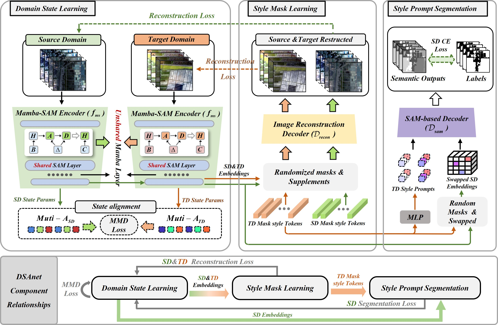

# Domain Information Mining and State-Guided Adaptation Network (DSAnet)

> **Domain Information Mining and State-Guided Adaptation Network for Multispectral Image Segmentation**  
> *Boyu Zhao, Mengmeng Zhang, Wei Li*, Yunhao Gao, Junjie Wang*  
> IEEE Transactions on Neural Networks and Learning Systems (TNNLS), 2025

---

## Abstract

**Segment Anything (SAM)**, as a prompt-based image segmentation foundation model, demonstrates strong task versatility and domain generalization capabilities, providing a new direction for cross-scene segmentation.  
However, SAM still faces challenges in **multi-spectral cross-domain segmentation**, mainly reflected in:

1. **Limited domain information utilization** — For the **source domain (SD)**, SAM is primarily trained on visible light images, causing its features to focus mainly on RGB semantics while neglecting non-visible spectral information. For the **target domain (TD)**, SAM overlooks the spectral and spatial domain shift between SD and TD, as it is fine-tuned using only labeled SD samples and ignores unlabeled TD data.  
2. **Limited cross-domain adaptation capability** — Although SAM learns certain domain-invariant features from large-scale pretraining, its structure lacks explicit domain adaptation mechanisms. When SD and TD exhibit significant distribution differences, SAM struggles to adapt directly to TD data, leading to degraded segmentation performance.

To address these challenges, we combine the strengths of **Masked Autoencoder (MAE)** and **cross-domain adaptation** to propose **DSAnet** (*Domain Information Mining and State-Guided Adaptation Network*), an improved SAM-based framework for multi-spectral segmentation.

- At the **data level**, DSAnet introduces a **Style Masking Learning** module that randomly masks image features and replaces them with domain-specific learnable tokens. This mechanism, integrated with reconstruction tasks, mines both domain-invariant and style-specific representations.  
- At the **task level**, DSAnet employs **Domain State Learning** and **Style-Guided Segmentation**:
  - *Domain State Learning* models inter-domain differences through learnable state sequences for SD and TD, mitigating task shift and enabling direct inference usage.  
  - *Style-Guided Segmentation* leverages TD style prompts to guide SD segmentation training, enhancing SAM’s adaptability to multi-spectral cross-domain tasks.

Extensive experiments on two multi-temporal MSI datasets demonstrate the superiority of DSAnet compared with state-of-the-art cross-domain and SAM-based methods.

  

---
